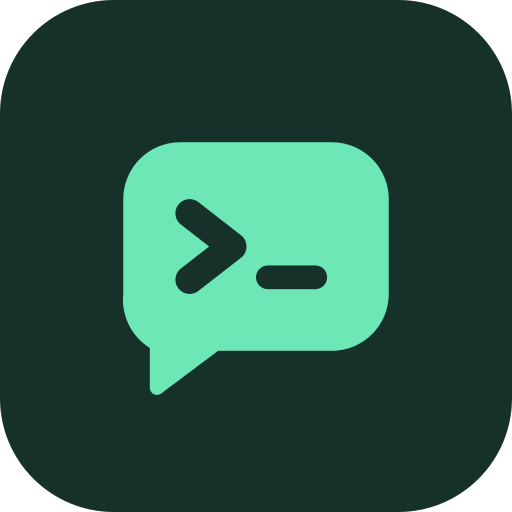

<p align="center">
  
</p>

<h1 align="center">Herdroid</h1>

<p align="center">
  Read and steer your <a href="https://herdr.dev">herdr</a> coding agents from your Android phone.
</p>

<p align="center">
  <a href="https://github.com/artogahr/herdroid/actions/workflows/ci.yml"></a>
  <a href="https://github.com/artogahr/herdroid/releases/latest"></a>
  <a href="LICENSE"></a>
</p>

herdr runs coding agents in terminal panes. Herdroid connects to the machine that runs
herdr over SSH and shows each agent session as a chat. You can answer an agent's question,
approve a command, or send a new prompt without opening a terminal. Every pane also has a
real terminal view for everything else.

Herdroid installs nothing on your server. It uses the SSH server you already have and the
API that herdr already provides.

## Features

- **Agent sessions as chats** for Claude Code, Codex and Kimi Code, rebuilt from the agents'
  own transcripts. Markdown, code blocks, and tool calls grouped into short summaries such as
  "Ran 3 commands".
- **Questions and approvals as buttons.** When an agent asks something, Herdroid reads the
  prompt from its screen and shows the choices as a card.
- **A terminal for every pane.** Watch any pane, or take control to type. Other panes and
  shells open straight in the terminal.
- **herdr's layout.** The side panel shows spaces on top and agents below, with a status dot
  for each agent. Swipe between the panes of a tab, and on into the next tab.
- **Spaces and agents.** Create and rename spaces, and rename agents, from the phone.
- **Saved servers.** Herdroid connects to the last server on launch and reconnects when the
  connection drops. Add server finds SSH servers on your Wi-Fi and over Bonjour. Once you
  are connected to one server, it also lists the other machines on your tailnet.
- **Pinch to zoom** the chat text, as in Google Messages.

## Requirements

- A computer running herdr 0.9 or newer. Check the API bridge with
  `herdr remote-api-bridge --check`. It prints `herdr-api-bridge-v1`.
- An SSH server on that computer that accepts public key login. On macOS, turn on
  **System Settings > General > Sharing > Remote Login**.
- A network path from the phone to the computer. [Tailscale](https://tailscale.com) works
  from anywhere; the same Wi-Fi also works.
- A phone with Android 10 or newer.

## Install

Download `herdroid-<version>.apk` from the
[latest release](https://github.com/artogahr/herdroid/releases/latest) and open it on the
phone. Android asks you to allow installs from your browser or file manager the first time.

Each release lists the APK's SHA-256 checksum and signing certificate fingerprint. To check
a download:

```sh
sha256sum herdroid-0.1.0.apk
apksigner verify --print-certs herdroid-0.1.0.apk
```

## Set up

1. Open Herdroid. The Servers screen shows **This phone's public key**. Tap **Copy** or
   **Share**.
2. On the computer, add the key as one line to `~/.ssh/authorized_keys`.
3. Tap **Add server**. Pick the computer from **Nearby servers**, or type its host name or
   IP address, your user name and the SSH port. Tap **Save and connect**.
4. Herdroid shows the server's host key fingerprint. Compare it with the output of
   `ssh-keygen -lf /etc/ssh/ssh_host_ed25519_key.pub` on the computer, then tap **Trust**.
   Herdroid remembers the key and refuses to connect if it changes.

Herdroid finds herdr through your login shell (`$SHELL -lc 'command -v herdr'`), so herdr
must be on the `PATH` that your shell sets up at login.

## Use

| To | Do this |
| --- | --- |
| Open spaces and agents | Tap the menu button, or swipe right from the first pane |
| Switch panes | Swipe left or right |
| Start an agent or a terminal | Tap **+** next to the page dots and pick one |
| Switch between chat and terminal | Tap the icon at the top right |
| Answer a question | Tap a choice on the card above the message box |
| Stop the agent | Tap the stop button while it is working |
| Type in a terminal | Tap **Take control**. The pane on your computer resizes to fit the phone. |
| Rename a space or agent | Long-press it in the side panel |
| Change the text size | Pinch the chat with two fingers |

Messages you send while an agent is working wait in a queue and show their delivery state.
Herdroid never resends a message on its own. If it cannot tell whether a message arrived,
the message is marked as unclear and you choose to resend or dismiss it.

## Security and privacy

- The SSH key is created on the phone in the Android Keystore. On Android 13 and newer it
  is an Ed25519 key; older versions and devices without Ed25519 support use ECDSA P-256.
  The private key cannot be exported, not even by Herdroid.
- Herdroid pins each server's host key on first use and stops if it changes.
- Herdroid talks only to the servers you add. The Add server screen also probes port 22 on
  your local network and listens for Bonjour to suggest servers. There is no telemetry,
  analytics or crash reporting.
- Anyone who can unlock your phone and open Herdroid can control your agents. Use a screen
  lock.

To report a security problem, see [SECURITY.md](SECURITY.md).

## How it works

Herdroid keeps one SSH connection per server and opens a channel for each job:

- `herdr remote-api-bridge` for herdr's API: the session snapshot, live events, prompts and
  key presses.
- `tail -F` on the agent's transcript file for new messages as the agent writes them.
- `herdr terminal session observe` or `control` for the terminal view.

[docs/ARCHITECTURE.md](docs/ARCHITECTURE.md) describes the modules and data flow.

## Build from source

With [Nix](https://nixos.org) and flakes enabled, the dev shell has the JDK, the Android
SDK, adb and the formatters:

```sh
nix develop
nix run .#install   # build a debug APK and install it on the connected phone
```

Without Nix, install JDK 17 and the Android SDK (platform 37, build tools 37.0.0), then run
`./gradlew :app:assembleDebug` in `android/`.

Debug builds install as `dev.herdroid.debug`, next to a release build. See
[CONTRIBUTING.md](CONTRIBUTING.md) for tests and the development workflow.

## License

Herdroid is licensed under the [Apache License 2.0](LICENSE). The terminal view uses the
Termux `terminal-emulator` and `terminal-view` libraries, also Apache 2.0; see
[android/terminal/NOTICE.md](android/terminal/NOTICE.md).

Herdroid is an independent project and is not affiliated with herdr, Anthropic, OpenAI or
Moonshot AI.
